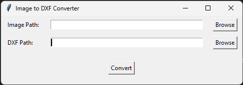

---

# ImageToDXF

ImageToDXF - это приложение на Python для конвертации изображений в формат DXF.

## Возможности

- Конвертация изображений в формате PNG, JPEG, BMP в формат DXF.
- Простой графический интерфейс пользователя на tkinter.
- Использует Pillow для обработки изображений и ezdxf для создания файлов DXF.

## Установка

1. Склонируйте репозиторий:

    ```bash
    git clone https://github.com/IslomUzbekov/ImageToDXF.git
    cd ImageToDXF
    ```

2. Установите зависимости:

    ```bash
    pip install -r requirements.txt
    ```

## Использование

Для запуска приложения выполните `main.py`:

```bash
python main.py
```

1. Нажмите кнопку "Browse" (Обзор), чтобы выбрать файл изображения (PNG, JPEG, BMP).
2. Нажмите кнопку "Browse" (Обзор), чтобы выбрать место для сохранения файла в формате DXF.
3. Нажмите кнопку "Convert" (Конвертировать), чтобы преобразовать выбранное изображение в формат DXF.

## Скриншоты


